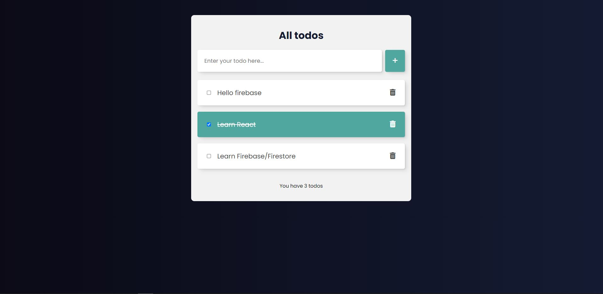

# EAS todo app

> I wanted to learn more about using firebase as a database to store todos. The project has full CRUD support with firebase.
> Live demo [_here_](https://eas-todos-app.netlify.app/). <!-- If you have the project hosted somewhere, include the link here. -->

## Table of Contents

- [General Info](#general-information)
- [Technologies Used](#technologies-used)
- [Features](#features)
- [Screenshots](#screenshots)
- [Setup](#setup)
- [Usage](#usage)
- [Project Status](#project-status)
- [Room for Improvement](#room-for-improvement)
- [Acknowledgements](#acknowledgements)
- [Contact](#contact)
<!-- * [License](#license) -->

## General Information

- Project aims to give the user the ability to add a list of todos. These todos can be updated, deleted and created using CRUD.
- I undertook the project because i wanted to learn more about working with a cloud based database.

## Technologies Used

- firebase: ^9.17.2,
- react: ^18.2.0,
- react-dom: ^18.2.0,
- sass: ^1.58.3

## Features

- Full CRUD functionality

## Screenshots



## Setup

To start the project, open the console and type:
`npm install`
then
`npm run dev`
to start the dev server.

## Usage

1. First and foremost you need to create a new project in firebase, follow their setup to add a project. Once done, enter the console of the project, and select "Firestore database" and create a collection. You will be provided with a firebase config file which will be important.

2. Create a firebase.js file in the src directory and paste in the config code provided by firebase like so:

```jsx
// Import the functions you need from the SDKs you need
import { initializeApp } from "firebase/app";
import { getFirestore } from "firebase/firestore";
// TODO: Add SDKs for Firebase products that you want to use
// https://firebase.google.com/docs/web/setup#available-libraries

// Your web app's Firebase configuration
const firebaseConfig = {
  apiKey: import.meta.env.YOUR_DB_PASSWORD,
  authDomain: import.meta.env.YOUR_DB_DOMAIN,
  projectId: "eas-todo", // Couldn't use env variable here for some reason, would break the db. Console says internet connection is failing
  storageBucket: import.meta.env.YOUR_DB_STORAGE_BUCKET,
  messagingSenderId: import.meta.env.YOUR_DB_SENDER_ID,
  appId: import.meta.env.YOUR_DB_APP_ID,
};

// Initialize Firebase
const app = initializeApp(firebaseConfig);
export const db = getFirestore(app);
```

3. Notice that env variables are in use, create an .env file (ignore it from github) and fill it in like in .env.sample with your own details.

4. For CRUD functionality to work, you need to update the "todos" string in all crud operations to whatever you've called your collection. If you have named your collection "todos", no changes needs to be made

```jsx
const createTodo = async (e) => {
  e.preventDefault();
  if (input === "") {
    setError(true);
    return;
  } else {
    setError(false);
  }
  await addDoc(collection(db, "YOUR_COLLECTION_NAME"), {
    text: input,
    completed: false,
  });
  setInput("");
};
```

## Project Status

Project is: _in progress_ / I want to implement login authentication, so that only logged in users can add a todo

## Room for Improvement

Room for improvement:

- Secure my firebase config info better, working on a way

To do:

- Update firebase config info security

## Acknowledgements

- This project was based on [this tutorial](https://www.youtube.com/watch?v=drF8HbnW87w&ab_channel=CodeCommerce) by Code Commerce.

## Contact

Created by [@eivindsimonsen](https://www.linkedin.com/in/eivind-simonsen-9469121b9/) - feel free to contact me!
Visit my portfolio [here](https://www.easimonsen.com/)
